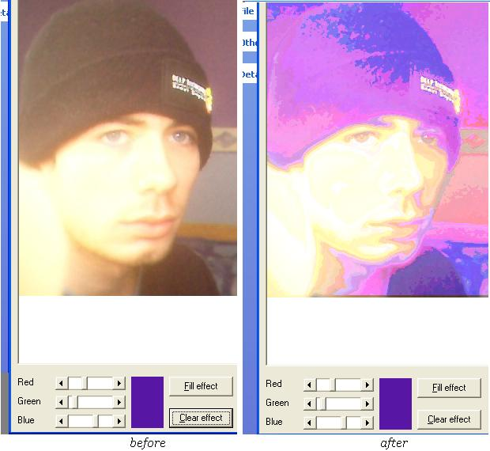



## Art effects, make your photos have cool effects

### Description

Load apicture in the picture box pic a colour of the effect and put it in to create strange effects every colour gives different kind of effects, commented on as much as possible.

Great use i found was making wall paper i used liam out of Oasis and made 6 different effects to the same photo and put them along side each other looked professional lol
 
### More Info
 

             |
---                |---
**Submitted On**   |2004-09-27 17:05:52
**By**             |[Ste Dunn](https://github.com/Planet-Source-Code/PSCIndex/blob/master/ByAuthor/ste-dunn.md)
**Level**          |Beginner
**User Rating**    |4.8 (19 globes from 4 users)
**Compatibility**  |VB 5\.0, VB 6\.0
**Category**       |[Graphics](https://github.com/Planet-Source-Code/PSCIndex/blob/master/ByCategory/graphics__1-46.md)
**World**          |[Visual Basic](https://github.com/Planet-Source-Code/PSCIndex/blob/master/ByWorld/visual-basic.md)
**Archive File**   |[Art\_effect18038910112004\.zip](https://github.com/Planet-Source-Code/ste-dunn-art-effects-make-your-photos-have-cool-effects__1-56671/archive/master.zip)

